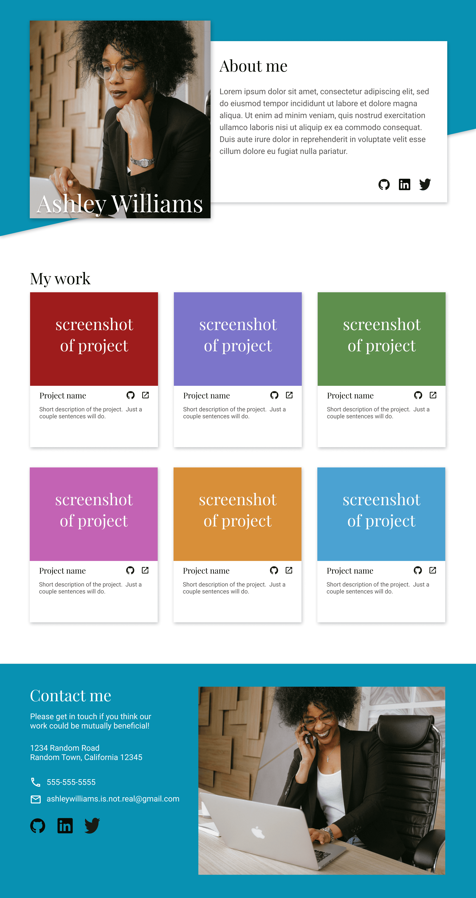

# Homepage

Responsive webpage that changes layouts when resizing the window (i.e., viewport).

[View webpage!](https://nirmalsubedi.github.io/odin-homepage/)

## Description

Task is to create a page that changes layout at different device sizes. The layout of the pages are specified below.

Desktop Layout:

Tablet Layout:

Mobile Layout:

## Skills demonstrated

- Creating breakpoints with css **media queries** to change page layout.

- Minifying image file sizes based on device dpi (device pixel per inch) and resolution.

- Add accessibility to page with **semantic HTML** ( landmarks & headings ).

- Hide elements in pure visual elements in **accessibility tree**.

- Grouping elements in accessability tree to create **regions**.

- Making images responsive to preserve aspect-ratio.

## Credits

- Photos by **www.kaboompics.com**:
  - [Header Image](https://www.pexels.com/photo/a-happy-woman-sitting-at-her-work-desk-8546757/)
  - [Footer Image](https://www.pexels.com/photo/a-woman-having-coffee-on-her-work-desk-8546753/)

- _Project from TOP (The Odin Project)_
